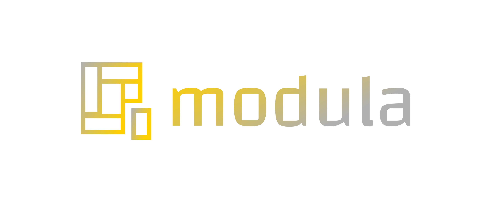

# logo
MODULA

# font


        Font in use <a target="_blank" href="https://www.fontsquirrel.com/fonts/changa">Changa-Regular</a> designed by
        <a target="_blank" href="http://www.tipo.net.ar/">Eduardo Tunni</a>
        and licensed under
        <a target="_blank" href="http://scripts.sil.org/cms/scripts/page.php?site_id=nrsi&amp;id=OFL_web">Open Font License.</a>
          Icon Designed by
          <a target="_blank" href="https://thenounproject.com/DPIcons">DPIcons</a>
          
# colors


Font
  #FFD000, #B0B0B0

Background
  #FFFFFF


Icon
  #B0B0B0, #FFD000
  
  
  
### css 
    p {
       font-family: 'HKGroteskRegular';
       font-weight: normal;
       font-style: normal;
    }


### html

    <link rel="stylesheet" media="screen" href="https://fontlibrary.org/face/hk-grotesk" type="text/css"/>
    
    
# Logo

## 1


## 2


---
+ [edit](https://github.com/modula-dev/logo/edit/master/README.md)
```
https://github.com/modula-dev/logo.git
```
